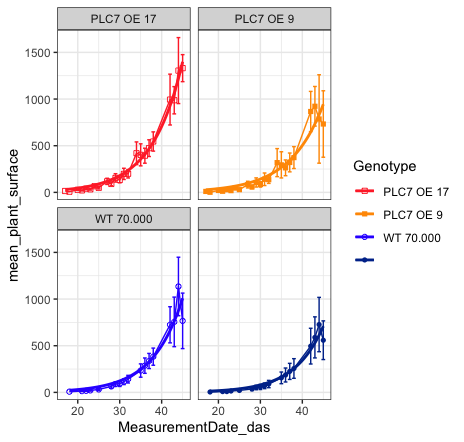

I have recently helped a colleague to add the curve from a `nls` model to its ggplot. 

## Final result (plot)
As someone mentioned before "let them eat the cake first" before giving the recipe. So here's the cake / plot!



## Input data
The input table (first 10 lines) looks like this: 


```R
> head(Plantsize_PLC7_WT, n = 10)
    X Plant3.ID  Genotype MeasurementDate_das gene          Device  stress   GT ExperimentID projPlantSurfaceArea_mm2 projPlantSurfaceArea_pixels2
1   1   1395478 PLC7 OE 9                  17   OE Growscreen 2D 5 control PLC7          790                   10.063                         8463
2   2   1395478 PLC7 OE 9                  20   OE Growscreen 2D 5 control PLC7          790                   21.520                        18098
3   3   1395478 PLC7 OE 9                  22   OE Growscreen 2D 5 control PLC7          790                   32.524                        27353
4   4   1395478 PLC7 OE 9                  24   OE Growscreen 2D 5 control PLC7          790                   45.753                        38478
5   5   1395478 PLC7 OE 9                  27   OE Growscreen 2D 5 control PLC7          790                   66.382                        55827
6   6   1395478 PLC7 OE 9                  29   OE Growscreen 2D 5 control PLC7          790                   89.233                        75045
7   7   1395478 PLC7 OE 9                  31   OE Growscreen 2D 5 control PLC7          790                  121.710                       102358
8   8   1395478 PLC7 OE 9                  34   OE Growscreen 2D 5 control PLC7          790                  173.157                       145625
9   9   1395478 PLC7 OE 9                  35   OE Growscreen 2D 5 control PLC7          790                  177.728                       149469
10 10   1395478 PLC7 OE 9                  42   OE Growscreen 2D 5 control PLC7          790                  664.268                       558649
```

## Code
And the pièce de résistance, the actual R code:  

```R
library("tidyverse")

Plantsize_PLC7_WT <- read.csv("~/Downloads/Plantsize_PLC7_WT.csv")

# part 1 = calculate the mean of the plant surface per genotype
Plantsize_PLC7_WT %>%
  group_by(GT, Genotype, MeasurementDate_das, stress) %>%
  summarise(
    mean_plant_surface = mean(
      projPlantSurfaceArea_mm2, 
      na.rm = TRUE),
    sd = sd(
      projPlantSurfaceArea_mm2, 
      na.rm = TRUE),
    se = sd / 2^0.5) %>%
  
  # part 2 = ggplot with geom_smooth
  ggplot(., 
         mapping = aes(color = Genotype,
                       shape = Genotype, 
                       x = MeasurementDate_das,
                       y = mean_plant_surface)) +
  geom_line() + 
  geom_point() +
  geom_errorbar(aes(ymin = mean_plant_surface - se, ymax = mean_plant_surface + se),) +
  theme_bw() +
  scale_color_manual(values=c("#FF3333","#FF9900", "#3333FF","#003399")) +
  scale_shape_manual(values = c(0, 15, 1, 16)) + 
  facet_wrap(~ Genotype) + 
  geom_smooth(method = "nls", 
              # x is mapped to MeasurementDate_das
              # y is mapped to mean_plant_surface
              formula = y ~ a * exp(b * x), 
              se =  FALSE, # this is important 
              method.args = list(start = list(a = 0.1, b = 0.1)))
```
